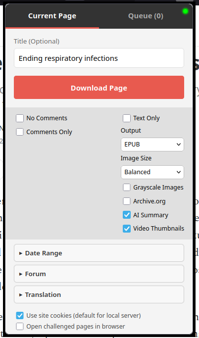
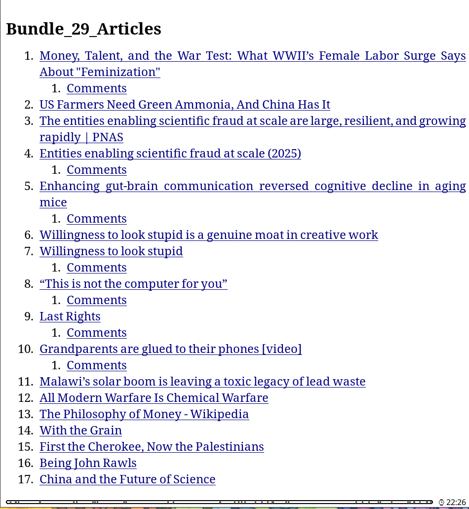
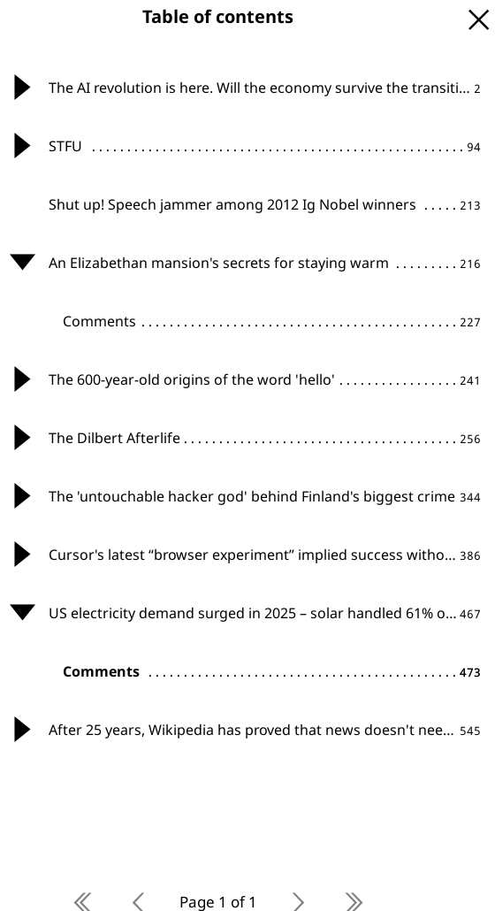
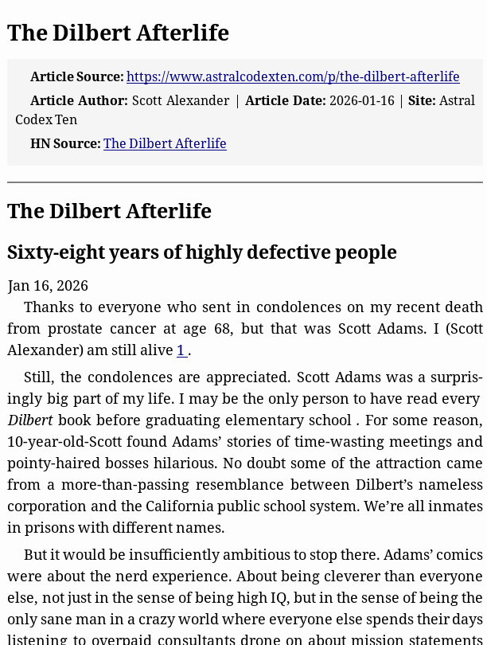
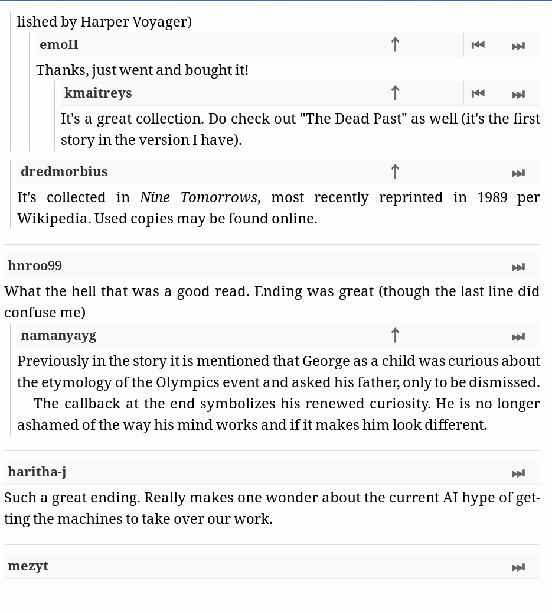
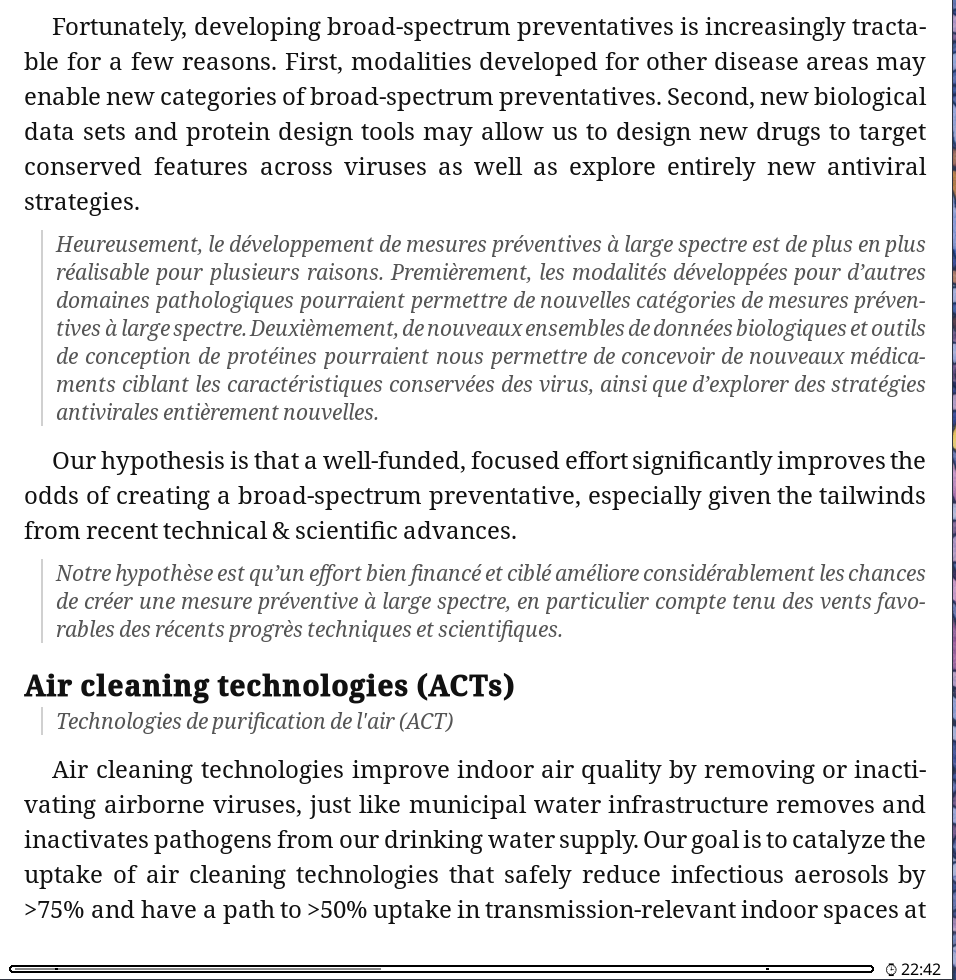

# dala: Web pages and threads as e-ink EPUBs

**dala** turns articles, comment threads, forum posts, Substack pages, and YouTube transcripts into clean EPUBs optimized for e-ink readers such as Kobo/KOReader. It works from a browser extension or CLI, can bundle many links into one anthology, and can preserve logged-in images or attachments when you explicitly share your browser session with the local backend. Translation support built in.

It is built for the "57 tabs I'll read later" problem: make an book out of it.

> Everything mostly usable, i'm sure something doesn't work.


## Screenshots

| Extension popup | Table of contents |
| --- | --- |
|  |  |

| Table of contents navigation | Article output |
| --- | --- |
|  |  |

<p align="center">
  
  <br />
  <em>Threaded comments with e-reader navigation controls.</em>
</p>

<p align="center">
  
  <br />
  <em>Underneath translation layout for bilingual reading.</em>
</p>

## Quick Start

```bash
git clone https://github.com/anaxonda/dala.git
cd dala
uv run dala-server
```

Install the browser extension:

- **Firefox:** install the release XPI when available, or load `firefox_extension/` temporarily from `about:debugging`.
- **Chrome/Brave/Edge:** open `chrome://extensions`, enable **Developer Mode**, click **Load unpacked**, and select `extension_chrome/`.

Then open a page, click the **dala** icon, and click **Download Page**.

For PDF output, CLI/server rendering of JavaScript-heavy pages, or server-side browser fallback, see [PDF and Server-Side Browser Rendering](#pdf-and-server-side-browser-rendering).

## What Do I Install?

| Goal | Best path | Extra setup |
| --- | --- | --- |
| Save a normal article | Extension or CLI | None |
| Save the current logged-in page | Extension | None |
| Save forum images or attachments behind login | Extension with **Use Site Cookies** | Usually none |
| Bundle browser links | Extension queue | None |
| Bundle URLs from a file | CLI | None |
| Render JavaScript-heavy pages without extension capture | CLI/server browser rendering | Server-side browser setup |
| Generate PDF | Extension or CLI | Same server-side browser setup |
| Download a YouTube transcript | CLI or extension | None |
| AI summaries or LLM translation | CLI or extension | API key |
| Google Translate translation | CLI or extension | No API key |

Server-side browser setup uses Dala's optional Python browser-control support plus either an existing Chrome/Edge/Brave/Chromium install or Playwright's managed Chromium; details are below.

## Source Support

| Source | Supported |
| --- | --- |
| Articles and blogs | EPUB/PDF, images, captions, cleanup, date-range discovery, Internet Archive fallback |
| Hacker News | Nested comments with parent/sibling/thread navigation |
| Reddit | Posts, linked article extraction, nested comments, comment images |
| Substack | Posts, images, comments, custom domains |
| WordPress | WordPress-specific post and comment extraction |
| Forums | Multi-page threads, logged-in images/attachments, quote-link rewriting |
| YouTube | Transcripts, optional comments, thumbnails, AI cleanup |

## Output and Reading Features

| Feature | Supported |
| --- | --- |
| EPUB | E-reader-oriented typography, metadata, table of contents, image optimization |
| PDF | Document and e-reader presets through server-side browser rendering |
| Bundles | Multiple pages combined into one anthology-style file |
| Images | Compact, Balanced, or Full presets; optional grayscale conversion |
| Translation | LLM or Google Translate; underneath, side-by-side inspired by [Bitextual](https://github.com/wydengyre/bitextual), EPUB footnote, or replace modes |
| Summaries | Optional LLM-generated summaries for long articles, discussions, forums, and transcripts |

## Common Workflows

### Save the current browser page

Start the backend, open a readable page in your browser, then use the extension's **Download Page** button. This is the easiest path for pages where your browser already has the right login/session state.

### Bundle many links

Use the extension context menu to add links to the queue, then open the popup and click **Download Bundle**. From the CLI, put one URL per line in a file and use `--bundle`.

### Download YouTube transcripts

```bash
# Basic transcript cleanup, no API key required
uv run dala "https://www.youtube.com/watch?v=VIDEO_ID"

# Prefer auto-generated captions and include comments
uv run dala --yt-auto --yt-max-comments 50 "https://www.youtube.com/watch?v=VIDEO_ID"

# Use an LLM for transcript cleanup
uv run dala --llm "https://www.youtube.com/watch?v=VIDEO_ID"
```

### Translate or summarize

```bash
# Summary
uv run dala --summary "https://example.com/article"

# Bilingual Spanish translation under each paragraph
uv run dala --translate es --translation-display underneath "https://example.com/article"

# Translated-only output
uv run dala --translate es --translation-display replace "https://example.com/article"

# Include comments/forum text in translation
uv run dala --translate es --translation-scope all-readable "https://example.com/article"
```

## Security and Privacy Notes

- The extension can send the current page HTML and captured page assets to the Dala backend.
- When **Use Site Cookies** is enabled, the extension can send site cookies to the backend so it can fetch protected images or attachments.
- Keep the backend bound to `127.0.0.1` unless you intentionally configure LAN or remote access.
- Only enable cookie sharing for a backend you control and trust.
- Do not expose the Dala server directly to the public internet.
- API keys in the extension or `.env` are secrets. Do not commit `.env`.
- Dala is intended to process pages you are allowed to access. Use authenticated capture and browser fallback responsibly.

## PDF and Server-Side Browser Rendering

Basic EPUB downloads do not need server-side browser rendering. This section is about Dala's optional Python support for controlling a browser on the server, not the browser extension.

Install the optional dependency group only if you want PDF output, CLI/server rendering of JavaScript-heavy pages, or server-side browser fallback:

```bash
uv sync --extra browser
uv run dala-server
```

Dala can then use an existing Chromium-compatible browser such as Chrome, Edge, Brave, or Chromium. If none is installed or detected, install Playwright's managed Chromium:

```bash
uv run playwright install chromium
```

<details>
<summary>CLI examples for server-side browser rendering</summary>

```bash
# Render with an auto-detected browser
uv run dala --browser "https://example.com/article"

# Show the browser window for login/debugging
uv run dala --browser --headed "https://example.com/article"

# Point Dala at a specific browser
uv run dala --browser --browser-executable /usr/bin/google-chrome "https://example.com/article"

# Reuse a dedicated browser profile
uv run dala --browser --browser-profile .browser-profile "https://example.com/article"

# Load an unpacked Chromium-compatible extension
uv run dala --browser --browser-extension /path/to/unpacked-extension "https://example.com/article"
```

</details>

<details>
<summary>Common browser executable paths</summary>

```bash
# macOS
uv run dala --browser --browser-executable "/Applications/Google Chrome.app/Contents/MacOS/Google Chrome" "https://example.com/article"

# Windows PowerShell
uv run dala --browser --browser-executable "C:\Program Files\Google\Chrome\Application\chrome.exe" "https://example.com/article"

# Linux
uv run dala --browser --browser-executable google-chrome "https://example.com/article"
```

</details>

PDF rendering uses the same browser detection and executable settings. EPUB output may use optimized WebP assets; PDF output feeds Chromium temporary JPEG render assets to avoid oversized embedded RGB image streams.

## Authenticated Pages, Forums, and Difficult Sites

Dala can process pages that are already readable in your browser, including pages that need your login session for images or attachments.

### Forums and gated images

- Log in to the forum in your browser.
- Use the extension with **Use Site Cookies** enabled.
- Enable **Force Forum Driver** if forum auto-detection misses the thread.
- Use **Forum Pages** or **Max Pages** for long threads.

### Difficult article pages

The simplest workflow is normal browser capture: open the article until it is readable in your everyday browser, then click the Dala extension. If you use a browser extension to make pages readable, install it in the same browser where you run Dala.

Server-side browser fallback is an advanced local fallback for automation and testing. The server uses a dedicated Dala browser profile at `~/.local/share/dala/browser-profile` by default; it does not automatically use your normal browser profile.

<details>
<summary>Advanced: server-side BPC helper for local testing</summary>

If an unpacked Bypass Paywalls Clean Chrome extension exists at `config/bpc/chrome-unpacked/bypass-paywalls-chrome-clean-master`, the server can use it for browser fallback. You can override paths with:

```bash
export DALA_BPC_EXTENSION_PATH=/path/to/unpacked/bypass-paywalls-chrome-clean
export DALA_BROWSER_EXECUTABLE=/usr/bin/google-chrome
export DALA_BROWSER_PROFILE_DIR=/path/to/custom/dala-chromium-profile
```

To refresh the local BPC helper used for testing:

```bash
git clone --depth 1 https://gitflic.ru/project/magnolia1234/bpc_uploads.git config/bpc/latest
mkdir -p config/bpc/chrome-unpacked
unzip -oq config/bpc/latest/bypass-paywalls-chrome-clean-master.zip -d config/bpc/chrome-unpacked
```

`config/bpc/` is ignored by git.

</details>

When a site serves an interactive bot challenge, Dala defaults to archive fallback. If **Open challenged pages in my browser** is enabled, the extension opens the original article URL and asks you to run Dala again from the readable tab.

## Extension Options

The extension has a compact popup for common choices and an Options page for server, diagnostics, and advanced behavior.

<details>
<summary>Extension options reference</summary>

| Option | What it does | When to use it |
| --- | --- | --- |
| **Server URL** | Chooses the Dala backend used by popup checks, helper parsing, jobs, downloads, and cancellation. | LAN/remote server workflows; leave as localhost for normal desktop use. |
| **No Comments** | Skips downloading comments. | Article-only output from HN, Reddit, Substack, WordPress, or YouTube. |
| **Comments Only** | Skips the main article body. | Ask HN, Reddit, or discussion-first reading. |
| **Text Only** | Removes images. | Smaller/faster output. |
| **Image Size** | Compact, Balanced, or Full image mode. | Compact for small e-reader EPUBs; Full when size is less important. |
| **Grayscale Images** | Converts images to grayscale. | Monochrome e-ink readers. |
| **Archive.org** | Forces Wayback Machine lookup. | Dead links or broken live pages. |
| **AI Summary** | Adds a 3-5 paragraph summary. | Long articles or transcripts; requires an API key. |
| **Translation** | Translates article text with LLM or Google Translate. | Bilingual reading or translated-only output. |
| **Video Thumbnails** | Embeds periodic YouTube thumbnails. | Visual context for transcripts. |
| **Use Site Cookies** | Sends browser cookies to the backend. Defaults on only for local server URLs. | Forums, protected images, authenticated pages. |
| **Server Browser Fallback** | Lets the server retry failed extraction in a Chromium-compatible browser. | JavaScript-heavy, blocked, or difficult pages. |
| **Force Forum Driver** | Uses forum multi-page scraping. | XenForo/vBulletin-style threads. |
| **Forum Pages** | Downloads specific pages such as `1,3-5`. | Partial forum thread downloads. |
| **Max Pages** | Limits sequential forum crawling. | Avoid unexpectedly large downloads. |

The Options page also includes diagnostics for server version, Playwright/browser/profile/BPC status, PDF availability, retained jobs, cleanup retention, and the last conversion status/error. If PDF is unavailable, the extension disables PDF output and falls back to EPUB.

</details>

## CLI Recipes

```bash
# Save one article
uv run dala "https://example.com/article"

# Save multiple URLs into one EPUB
uv run dala -i links.txt --bundle --bundle-title "Weekend Reading"

# Save all discovered posts from August 2025
uv run dala --start-date 2025-08 --end-date 2025-08 "https://example.wordpress.com/"

# Save a forum thread with cookies exported from your browser
uv run dala --forum --cookie-file cookies.txt --max-pages 5 "https://forum.example.com/thread"

# Compact grayscale images for a small e-reader EPUB
uv run dala --image-preset compact --image-color grayscale "https://example.com/article"

# Full-size images, but fail before writing if the bundle gets too large
uv run dala --image-preset full --max-bundle-images 250 --max-image-bytes-mb 200 -i links.txt --bundle

# Smoke-test translation configuration
uv run dala --translate es --test-translation-provider "Hello world"
```

## CLI Reference

<details>
<summary>Full CLI flag reference</summary>

| Flag | Description |
| --- | --- |
| `-o`, `--output PATH` | Output filename. |
| `--format epub\|pdf` | Output file format. |
| `--pdf-preset document\|ereader` | PDF layout preset. |
| `--pdf-page-size letter\|a4\|kobo_clara` | PDF page size. |
| `--bundle` | Combine input URLs into one anthology EPUB/PDF. |
| `--bundle-title "..."` | Set the anthology title. |
| `--bundle-author "..."` | Set the anthology author. |
| `-i`, `--input-file PATH` | Read URLs from a file, one per line. |
| `--no-article` | Skip the article body. |
| `--no-comments` | Skip comments. |
| `--no-images` | Text-only output. |
| `--image-preset compact\|balanced\|full` | Image optimization and budget preset. Balanced is default; compact uses smaller 720px WebP assets. |
| `--image-color color\|grayscale` | Keep color or convert images to grayscale. |
| `--max-bundle-images N` | Override the image count budget before EPUB/PDF write. |
| `--max-image-bytes-mb N` | Override the optimized image byte budget before EPUB/PDF write. |
| `-a`, `--archive` | Force Internet Archive lookup. |
| `--css PATH` | Inject custom CSS. |
| `--max-depth N` | Limit recursive comment depth. |
| `--forum` | Force the forum driver. |
| `--max-pages N` | Limit forum pages. |
| `--max-posts N` | Limit forum posts. |
| `--pages 1,3-5` | Download specific forum pages. |
| `--cookie-file cookies.txt` | Load Netscape-format cookies for CLI authentication. |
| `--start-date DATE` | Discover posts on/after `YYYY`, `YYYY-MM`, or `YYYY-MM-DD`. |
| `--end-date DATE` | Discover posts on/before `YYYY`, `YYYY-MM`, or `YYYY-MM-DD`. |
| `--date-fallback auto\|shallow\|metadata\|full` | How hard to work to find post dates during discovery. |
| `--include-undated` | Include discovered posts with no date. |
| `--max-discovery-pages N` | Maximum listing/archive pages to scan. |
| `--max-discovered-posts N` | Maximum post candidates to discover. |
| `--browser` | Fetch with a headless Chromium-compatible browser. |
| `--browser-extension PATH` | Load an unpacked Chromium-compatible extension with `--browser`. |
| `--browser-profile PATH` | Reuse a browser user data directory with `--browser`. |
| `--browser-executable PATH` | Use a specific Chrome/Edge/Brave/Chromium executable. |
| `--headed` | Show the browser window for login/debugging. |
| `--browser-timeout-ms N` | Browser navigation timeout. |
| `--browser-wait-until load\|domcontentloaded\|networkidle\|commit` | Playwright navigation wait condition. |
| `--browser-settle-ms N` | Extra delay after navigation before capture. |
| `--browser-challenge-action archive\|user_browser\|warm` | Bot-challenge behavior. |
| `--llm` | Use AI to format/clean text, mainly transcripts. |
| `--llm-provider auto\|gemini\|openrouter\|openai` | Choose the LLM API family. |
| `--llm-model MODEL` | Choose the LLM model. |
| `--api-key KEY` | API key override. Prefer `.env` or shell secrets for normal use. |
| `--summary` | Generate an AI summary. |
| `--translate LANG` | Translate text to a target language. |
| `--translation-provider llm\|google` | Choose translation provider. |
| `--translation-source LANG` | Source language; default `auto`. |
| `--translation-display underneath\|side-by-side\|popup-footnote\|replace` | Translation layout. Popup footnotes are EPUB-only. |
| `--translation-scope article\|article-captions\|all-readable` | Translate article only, article plus captions, or all readable text including comments/forums. |
| `--translation-glossary PATH` | Preserve/map terms using `source=target` lines. |
| `--no-translation-cache` | Disable persistent translation cache. |
| `--clear-translation-cache` | Remove the persistent translation cache. |
| `--test-translation-provider TEXT` | Translate a short text and print the result without downloading. |
| `--yt-lang en,es` | Preferred YouTube transcript languages. |
| `--yt-auto` | Prefer auto-generated YouTube captions. |
| `--thumbnails` | Embed periodic YouTube thumbnails. |
| `--yt-max-comments N` | Maximum YouTube comments. |
| `--yt-sort top\|new` | YouTube comment sort order. |

</details>

## Configuration

### LLM configuration precedence

LLM and translation settings are resolved in this order:

1. Extension settings.
2. CLI flags.
3. Environment variables or `.env`.

### Environment variables

Create `.env` in the project root for persistent local settings. Do not commit it.

```env
# AI / LLM keys
GEMINI_API_KEY=your-gemini-api-key
OPENROUTER_API_KEY=your-openrouter-api-key
OPENAI_API_KEY=your-openai-api-key

# Default LLM provider/model
LLM_PROVIDER=auto
LLM_MODEL=gemini-3.1-flash-lite

# Browser fallback
DALA_BROWSER_EXECUTABLE=/path/to/chrome-or-chromium
DALA_BROWSER_PROFILE_DIR=/path/to/dala-browser-profile
DALA_BPC_EXTENSION_PATH=/path/to/unpacked-extension

# Translation speed tuning
DALA_GOOGLE_TRANSLATE_CHUNK_SIZE=5
DALA_GOOGLE_TRANSLATE_CONCURRENCY=5
DALA_TRANSLATION_CONCURRENCY=3

# Server job cleanup
DALA_JOB_RETENTION_SECONDS=7200
DALA_JOB_CLEANUP_INTERVAL_SECONDS=300
```

## Where Files Are Saved

| Workflow | Default output location |
| --- | --- |
| CLI | Current working directory, unless `--output` is set. |
| Browser extension download | Browser Downloads folder, optionally under the configured Download Subfolder. |
| Server save directory set | The absolute path configured on the server machine. |
| Always Archive enabled | `exports/` inside the Dala project. |
| Failed browser download with server archive | Server copy remains available from the job/download endpoint until cleanup. |

CLI and extension outputs use the same title-based naming helpers where possible, but browser downloads may additionally apply browser-specific conflict renaming.

## Platform-Specific Installation

Dala is primarily tested on Linux and Android/Termux. macOS and Windows should work with the commands below; report platform-specific issues if you hit them.

<details>
<summary>macOS, Windows, Linux, Android, and pip setup</summary>

### Prerequisites

- Python 3.9+
- `uv`
- Git

Install `uv`:

```bash
# macOS
brew install uv

# Windows PowerShell
powershell -c "irm https://astral.sh/uv/install.ps1 | iex"

# Linux
curl -LsSf https://astral.sh/uv/install.sh | sh

# Android / Termux
pkg install tur-repo
pkg install uv
```

### macOS

```bash
git clone https://github.com/anaxonda/dala.git
cd dala
uv run dala-server
```

macOS may prompt you to install Command Line Tools if Git is not installed.

### Windows

Open PowerShell:

```powershell
git clone https://github.com/anaxonda/dala.git
cd dala
uv run dala-server
```

If you see an execution policy error, run:

```powershell
Set-ExecutionPolicy RemoteSigned -Scope CurrentUser
```

### Linux

Use the Quick Start. For PDF or server-side browser rendering, use the setup above; Dala can auto-detect `chromium`, `google-chrome`, `microsoft-edge`, or `brave-browser` from `PATH`.

### Android / Termux

You can run the backend on your phone:

```bash
pkg update
pkg install git python tur-repo
pkg install uv
git clone https://github.com/anaxonda/dala.git
cd dala
```

If `uv` cache/linking gives trouble on Android, create the environment manually:

```bash
python -m venv .venv
source .venv/bin/activate
UV_LINK_MODE=copy UV_CACHE_DIR=$HOME/.cache/uv uv pip install -e .
uv run dala-server
```

Firefox for Android can use the extension against the local Termux server.

### Alternative: pip

```bash
# macOS / Linux
python3 -m venv .venv
source .venv/bin/activate
pip install -e .

# Windows
python -m venv .venv
.venv\Scripts\activate
pip install -e .
```

</details>

## Run in Background

Use this if you want the local Dala backend to start automatically instead of running `uv run dala-server` manually.

<details>
<summary>launchd, Windows Startup Folder, and systemd examples</summary>

### macOS launchd

Create `~/Library/LaunchAgents/com.dala.server.plist`:

```xml
<?xml version="1.0" encoding="UTF-8"?>
<!DOCTYPE plist PUBLIC "-//Apple//DTD PLIST 1.0//EN" "http://www.apple.com/DTDs/PropertyList-1.0.dtd">
<plist version="1.0">
<dict>
    <key>Label</key>
    <string>com.dala.server</string>
    <key>ProgramArguments</key>
    <array>
        <string>/usr/local/bin/uv</string>
        <string>run</string>
        <string>dala-server</string>
    </array>
    <key>WorkingDirectory</key>
    <string>/path/to/dala</string>
    <key>RunAtLoad</key>
    <true/>
    <key>KeepAlive</key>
    <true/>
    <key>StandardOutPath</key>
    <string>/tmp/dala.log</string>
    <key>StandardErrorPath</key>
    <string>/tmp/dala.err</string>
</dict>
</plist>
```

Load it:

```bash
launchctl load ~/Library/LaunchAgents/com.dala.server.plist
```

### Windows Startup Folder

Create `start_dala.bat` in the project folder:

```bat
@echo off
cd /d "%~dp0"
uv run dala-server
```

Press `Win + R`, enter `shell:startup`, and add a shortcut to `start_dala.bat`.

### Linux systemd

Create `~/.config/systemd/user/epub_server.service`:

```ini
[Unit]
Description=Web to EPUB Python Server
After=network.target

[Service]
WorkingDirectory=/path/to/dala
ExecStart=/path/to/dala/.venv/bin/dala-server
Restart=always
RestartSec=5

[Install]
WantedBy=default.target
```

Enable it:

```bash
systemctl --user enable --now epub_server
```

</details>

## sites.yaml Customization

You can define custom extraction rules for specific websites in `sites.yaml` at the project root.

```yaml
- name: "The New York Times"
  domains:
    - "nytimes.com"
  content_selector: "article#story"
  remove:
    - "#top-wrapper"
    - ".ad-container"
    - "div[data-testid='recirculation']"
```

- `content_selector`: CSS selector for the main article text.
- `remove`: CSS selectors to strip before EPUB/PDF generation.

## Troubleshooting

### The extension says the server is offline

Start the backend:

```bash
uv run dala-server
```

Then open `http://127.0.0.1:8000/ping`.

### The EPUB downloads but images are missing

- For logged-in pages, enable **Use Site Cookies** and make sure the page is readable in your browser.
- Try **Full** image mode if a site uses unusual thumbnails or lazy-loaded images.
- For forums, enable **Force Forum Driver** and keep **Use Site Cookies** enabled.

### PDF option is disabled

Install server-side browser rendering support:

```bash
uv sync --extra browser
```

Restart the server and check `http://127.0.0.1:8000/ping`. If no Chrome, Edge, Brave, or Chromium executable is detected, run `uv run playwright install chromium`.

### Browser fallback fails

Use headed mode to debug login, bot challenges, or extension loading:

```bash
uv run dala --browser --headed "https://example.com/article"
```

If an interactive bot challenge appears, solve it in your normal browser and run the extension from the readable tab.

### Android / Termux cannot find uv

```bash
pkg install tur-repo
pkg install uv
```

If `uv run` still fails, use the manual virtualenv setup from [Android / Termux](#android--termux).

### Translation fails

- Confirm the API key is present in `.env`, the extension settings, or the shell.
- Run `uv run dala --translate es --test-translation-provider "Hello world"`.
- For Google Translate, confirm `deep-translator` is installed through the normal project dependencies.

## Architecture

```text
Browser extension or CLI input
    |
Driver selection
    |
HTML, transcript, comment, or forum extraction
    |
Image fetching, cleanup, optimization, and budgeting
    |
EPUB/PDF generation
    |
Browser download, CLI output, or server archive
```

- `dala/drivers/`: source-specific extraction for HN, Reddit, Substack, YouTube, WordPress, forums, and generic articles.
- `dala/core/`: shared extraction, browser fallback, image processing, translation, discovery, job, and writer logic.
- `server.py`: FastAPI backend used by the extensions and async job flow.
- `firefox_extension/` and `extension_chrome/`: browser clients for page capture, queueing, options, and downloads.

## Roadmap

### Planned

- Markdown output for note-taking apps.
- Translation polish, provider quality controls, and review tooling.
- More fixture-based tests for brittle extraction heuristics.
- Better progress reporting for long bundles.

### Ideas

- Crawler mode with same-domain/main-content guardrails.
- RSS feed ingestion.
- More date-range archive patterns.
- HN/Reddit index filtering by points, dates, or comment counts.

## License

[MIT](LICENSE)
